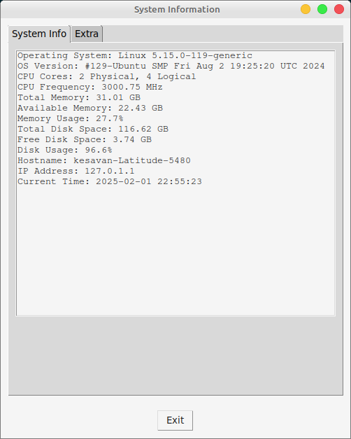
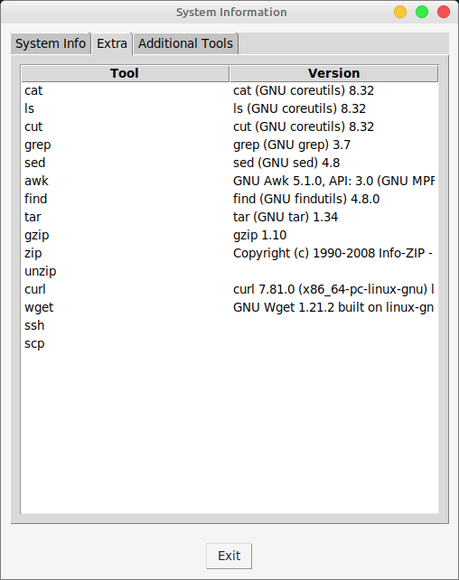
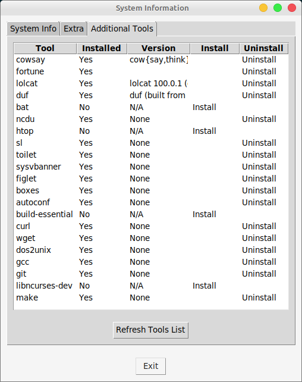
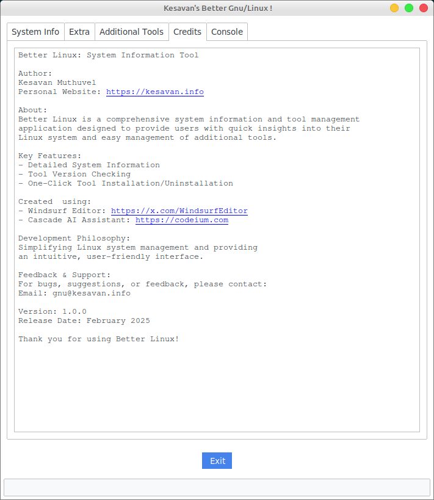
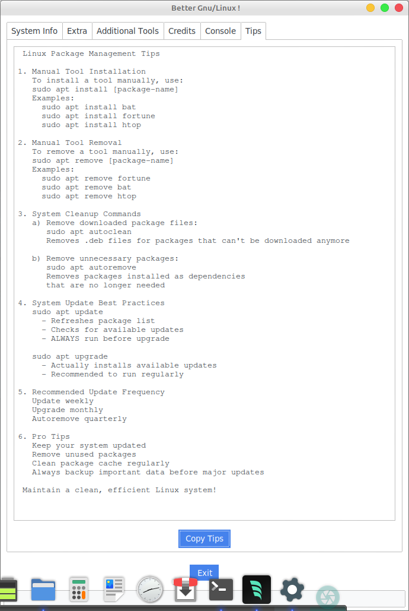

# Kesavan's Better Gnu/Linux !

## Overview
A comprehensive system information and tool management application for Linux, designed to provide an intuitive and powerful interface for system insights.

### Features
- System information - OS, CPU, Memory, Disk
- Extra Tools  - Listing of available tools - cowsay, fortune, lolcat, duf, bat, ncdu, htop, sl, toilet, sysvbanner, figlet, boxes
- Additional tools - Installation of available tools.  User can install or uninstall tools. This includes cowsay, fortune, lolcat, duf, bat, ncdu, htop, sl, toilet, sysvbanner, figlet, boxes

### Pre-requisites
- Python 3.6 or higher
- pip installed

### Installation
- `pip install -r requirements.txt`

### Usage
- Run the application : `python3 better-linux.py`

## 📸 Screenshots

### System Info

### Tools Version

### Additional Tools

### Credits
- Kesavan (https://github.com/kesavan)

### Tips
- Maintain a clean, efficient Linux system!
- Always backup important data before major updates
- Run `apt update` and `apt upgrade` regularly
- Remove unused packages using `apt autoremove`
- Clean package cache with `apt autoclean`

