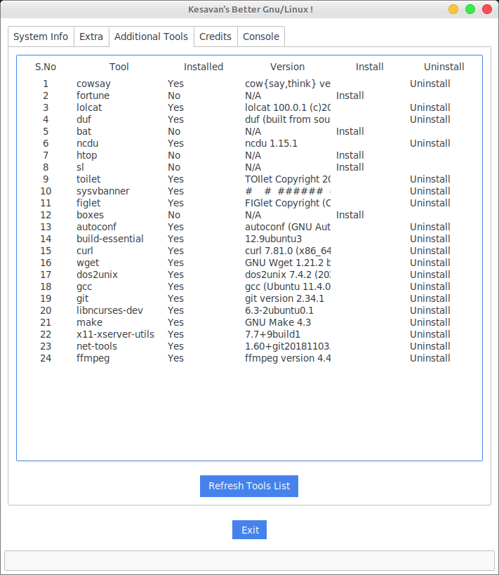

# better-linux
{{ ... }}

### Better Linux is a Python application that provides system information, tools versions, and additional tools.

### Features
- System information - OS, CPU, Memory, Disk
- Extra Tools  - 
- Additional tools

## 📸 Screenshots

### System Info

### Tools Version

### Additional Tools

> **Note**: Screenshots are not yet available. To generate screenshots:
> 1. Run the application
> 2. Take screenshots of each tab
> 3. Save them in a `screenshots` directory with the following names:
>    - `system_info.png`
>    - `tools_version.png`
>    - `additional_tools.png`
{{ ... }}